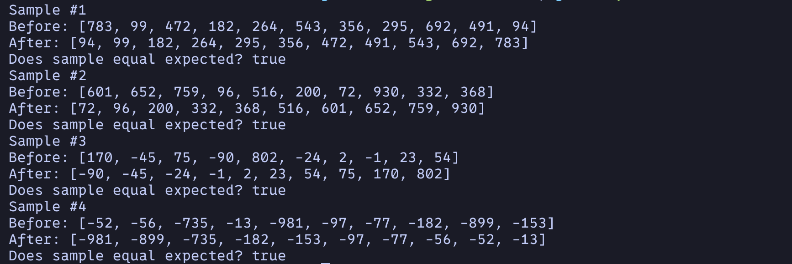

# Module 5
A simple Java program that. 

## Usage
1. Ensure you are in the correct directory of the sub-project.
2. Run ```javac src/*.java -d build``` to generate class files.
3. Run ```java -cp build Main``` to start the program.
4. Enjoy the program(s).

## Examples


## Notes
The program may not exit properly if it is force quit.
